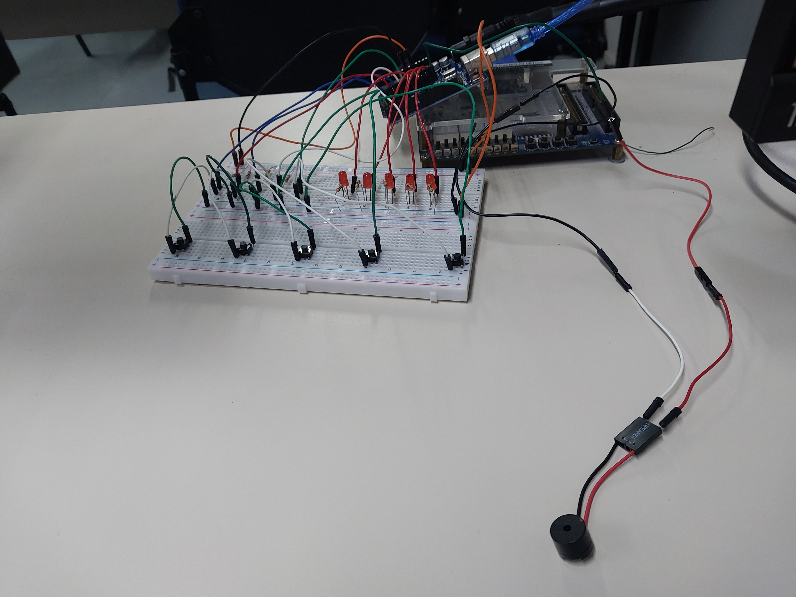

# Pianinho-Eletronica

# Integrantes

- Pedro Vitor Suzuki Lau - 13837133 
- Gustavo Henrique Brunelli - 11801053
- Christian Bernard - 11795572
- Philippe Sardenberg Castro Couto - 16897421

Pianinho que consegue tocar as 5 primeiras notas: Dó, Ré, Mi, Fá, Sol. Podemos tocar cada nota ao pressionar os botões e fazer os respectivos leds acenderem.

| Componentes | Quantidade |
| ----------- | ---------- |
| LEDs Vermelhos | 5 |
| Botões | 5 |
| Jumpers Macho | 23 |
| Jumpers Fêmea | 2 |
| Resistores 10k Ohm | 5 |
| Resistores 1k Ohm | 5 |
| Arduino Uno | 1 | 
| Buzzer | 1 | 
